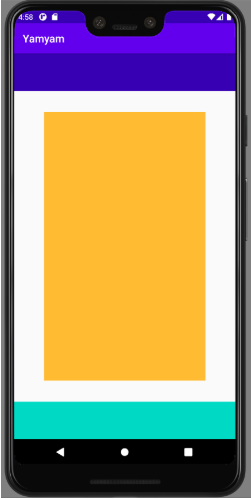
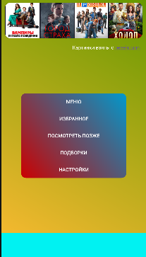

#Skillfactory. Разработка учебного приложения по поиску фильмов.

##Проектная работа

IDE -> Android Studio 2024.2.1.12

##Задание 1.

1.1. Создать проект

File -> New -> New project\
Выбираем -> Empty View Activity\
Name -> задаём имя приложения (это имя будет использоваться как название приложения, его можно изменить потом\
Package name -> является уникальным идентификатором в Google Play и на устройстве, поэтому желательно задавать его осознанно\
Language -> Kotlin\
Minimum SDK -> 24

1.2. Создать контейнер под меню с кнопками\
1.3. Создать контейнер под нижнее меню\
1.4. Создать контейнер под верхнее меню

Задание ⭐: сделайте верстку «резиновой», добейтесь того же эффекта, не задавая размеры контейнера (использовать margins)

Готовый результат:

##Задание 2.

2.1. Добавить кнопки меню;\
2.2. Вставить постеры фильмов;\
2.3. Вставить текстовые поля;\
2.4. Применить Drawable для фонов;\
2.5. Применить CardView для закругленных углов и левитации;\
2.6. Добавьте на нажатие каждой кнопки функционал с показом Toast-сообщений.

Задание ⭐: Создайте ресурсы под различные дисплеи при помощи квалификаторов.

Готовый результат:

##Задание 3.

3.1. Сделать рефакторинг наших View на Material компоненты.\
3.2. Добавить в приложение MaterialToolbar.\
3.3. Перенести кнопки меню в Toolbar и панель навигации.

Задание ⭐: Создайте темную/светлую тему приложения, используя квалификаторы.

##Задание 4.

4.1. Добавьте на экран несколько постеров и анимируйте их появление.\
4.2. Сделайте анимацию нажатия на постер.

Задание ⭐: Примените не менее трёх подходов к созданию анимации.